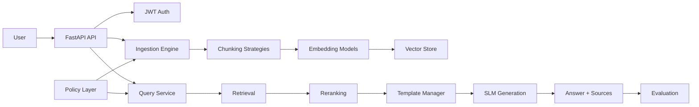

# MicroBrain

MicroBrain is a multi-user RAG + SLM platform built to ingest user documents, organize them into chunks, embed them, store them in a vector database, retrieve and rerank relevant context, and generate answers with a local or hosted small language model.

The current codebase already contains the main building blocks for a real RAG stack. What is still evolving is the breadth of document normalization, the policy-driven routing depth, and how broadly generation can fan out beyond the current SLM path.

## What is implemented today

### Core pipeline

- Multi-user auth with JWT-based login and per-user isolation.
- Document upload and ingestion through the FastAPI backend.
- **Folder-based document organization** for better categorization and targeted retrieval.
- Parsing for PDF, DOCX, TXT, Markdown, and HTML inputs.
- Chunking strategies for fixed, semantic, section-based, and recursive splits.
- Embedding backends for BGE, Cohere, and OpenAI.
- Vector storage backends for Chroma, FAISS, and Qdrant.
- Retrieval strategies for similarity, hybrid, and MMR-style selection.
- Re-ranking strategies including BM25, Cohere rerank, and cross-encoder rerank.
- Generation through the current Hugging Face inference path.
- Prompt template management with dynamic prompt formatting.
- Evaluation modules for RAGAS and DeepEval.
- Policy helpers that analyze documents and queries to recommend workflows.
- **Configurable processing** - chunking, embedding, and storage options selectable from frontend.
- **Configurable querying** - top-k retrieval, reasoning levels, and prompt templates from frontend.

### Current execution flow

1. A user uploads a document (with optional folder assignment and processing config).
2. The ingestion engine extracts text and classifies the document type.
3. The document is chunked, embedded, and stored in a vector index using selected strategies.
4. A user query is embedded and matched against stored chunks (with folder filtering option).
5. Retrieved context is assembled and passed into the SLM generation path.
6. The prompt layer selects or formats a template based on query type.
7. Query metadata, sources, and timing are stored for later inspection.

## Capability matrix

| Area | Status | Notes |
| --- | --- | --- |
| Document input normalization | Partial | Supports common text-document formats today; more modalities can be added. |
| Document organization | Partial | Metadata, classification, and workflow selection exist, but richer organization rules are still evolving. |
| Chunking | Implemented | Fixed, semantic, section, and recursive strategies are present. |
| Embedding | Implemented | BGE, Cohere, and OpenAI embedding backends are available. |
| Storage | Implemented | Chroma, FAISS, and Qdrant storage adapters exist. |
| Retrieval | Implemented | Similarity, hybrid, and MMR retrieval paths are present. |
| Ranking | Implemented | BM25, Cohere rerank, and cross-encoder rerank modules exist. |
| Generation | Implemented | Current generation is routed through the SLM/Hugging Face path. |
| Dynamic chat templates | Implemented | TemplateManager supports multiple prompt types and custom formatting. |
| Evaluation | Implemented | RAGAS and DeepEval evaluation engines are included. |
| Routing / policy | Partial | Workflow recommendation exists, but the active query path is still centered on the SLM flow. |

## Architecture



## Repo structure

- `app/api/` - FastAPI routers for auth, documents, queries, batch, admin, and folders.
- `app/services/` - Orchestration for document upload, query processing, auth, and batch flows.
- `app/engines/` - Chunking, embedding, retrieval, reranking, generation, prompting, storage, ingestion, and evaluation engines.
- `app/policy/` - Document and query analyzers plus workflow selection.
- `app/models/` - SQLAlchemy and response models for users, documents, queries, and folders.
- `microbrain-ui/` - Next.js frontend with React, TailwindCSS, and shadcn/ui components.
- `tests/` - API, auth, engine, and policy coverage.
- `Data/` - Local artifacts for prompts, chunks, embeddings, retrievals, responses, and processed outputs.

## What this repo is aiming for

The target is a proper RAG + SLM platform that can sit on top of user-provided documents and support:

- multiple document types and normalization paths,
- multiple chunking strategies,
- multiple embedding backends,
- multiple storage backends,
- retrieval plus ranking control,
- generation through a small language model,
- evaluation and traceability,
- policy-based routing that can select the best workflow per document or query,
- dynamic chat templates instead of a single hard-coded prompt.

## Current assessment

The repo is already past the basic prototype stage. The main RAG pipeline pieces exist, and the SLM path is wired up. The biggest remaining work is to make routing more explicit and configurable, broaden document handling beyond common text-centric inputs, and tighten the evaluation and policy layer so it can choose workflows more consistently rather than only describing them.

In short: the platform foundation is here, but the README should treat it as an evolving RAG/SLM system rather than a finished generalized framework.

## Quick start

### Backend Setup

1. Create and activate a Python virtual environment:
   ```bash
   python -m venv venv
   source venv/bin/activate  # On Windows: venv\Scripts\activate
   ```

2. Install backend dependencies:
   ```bash
   pip install -r requirements.txt
   ```

3. Configure environment variables (copy `.env.example` to `.env` and update):
   ```bash
   cp .env.example .env
   ```

4. Run the FastAPI backend:
   ```bash
   python -m uvicorn app.main:app --host 0.0.0.0 --port 8000 --reload
   ```

### Frontend Setup

1. Navigate to the frontend directory:
   ```bash
   cd microbrain-ui
   ```

2. Install frontend dependencies:
   ```bash
   npm install
   ```

3. Start the Next.js development server:
   ```bash
   npm run dev
   ```

4. Access the UI at `http://localhost:3000`

## Recent Improvements

- **Folder-based organization**: Documents can now be organized into folders for better categorization and targeted retrieval.
- **Configurable processing**: Document upload now supports selecting chunking strategy, embedding model, and vector store from the frontend.
- **Configurable querying**: Query interface now supports top-k retrieval count, reasoning levels (basic/intermediate/advanced), and prompt template selection.
- **Fixed CORS and database issues**: Resolved CORS policy errors and database schema inconsistencies.
- **Improved loading states**: Fixed infinite loading buffers on documents and queries pages.

## Notes

- The repository currently keeps local data artifacts under `Data/` for prompts, chunks, embeddings, retrievals, and responses.
- The active query path uses the SLM generation flow and dynamic prompt templates.
- Policy modules already recommend workflows, but they are still a layer above the current execution path rather than a fully autonomous router.
- Database files (*.db) and uploaded documents are excluded from git via .gitignore.